# LangGraph Explained

This project demonstrates how to build conversational AI workflows using LangGraph.

## Project Overview

This educational repository teaches how to implement state-based conversation flows using LangGraph and LangChain. The project includes practical examples ranging from a basic chatbot to an intelligent routing system that classifies user messages and directs them to specialized AI agents.

### Key Features

- **Simple Chatbot**: A straightforward implementation showing basic LangGraph concepts
- **Intelligent Message Routing**: Advanced system that classifies user input and routes to appropriate specialized agents
- **Modular Agent Architecture**: Clean, extensible design using abstract base classes
- **Real-time Classification**: Automatic detection of whether messages require emotional or logical responses
- **Interactive CLI Interface**: Easy-to-use command-line interfaces for testing both implementations

### Use Cases

- Learning LangGraph fundamentals and state management
- Understanding conditional routing in conversational AI
- Building specialized agent systems (therapist vs. scientist responses)
- Prototyping multi-agent conversation flows

## Examples

`simple.py` computes this graph:

```mermaid
---
config:
  flowchart:
    curve: linear
---
graph TD;
        __start__([<p>__start__</p>]):::first
        chatbot(chatbot)
        __end__([<p>__end__</p>]):::last
        __start__ --> chatbot;
        chatbot --> __end__;
        classDef default fill:#000000,line-height:1.2
```

`complex.py` computes this graph:

```mermaid
---
config:
  flowchart:
    curve: linear
---
graph TD;
        __start__([<p>__start__</p>]):::first
        classifier(classifier)
        router(router)
        therapist-agent(therapist-agent)
        scientist-agent(scientist-agent)
        __end__([<p>__end__</p>]):::last
        __start__ --> classifier;
        classifier --> router;
        router -. &nbsp;scientist&nbsp; .-> scientist-agent;
        router -. &nbsp;therapist&nbsp; .-> therapist-agent;
        scientist-agent --> __end__;
        therapist-agent --> __end__;
        classDef default fill:#000000,line-height:1.2
```

